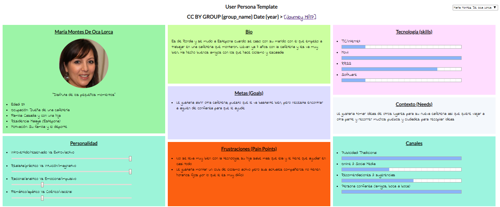
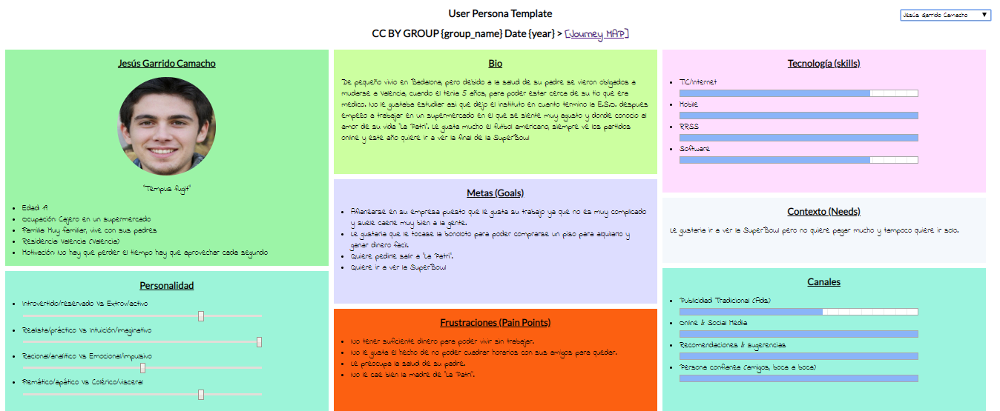
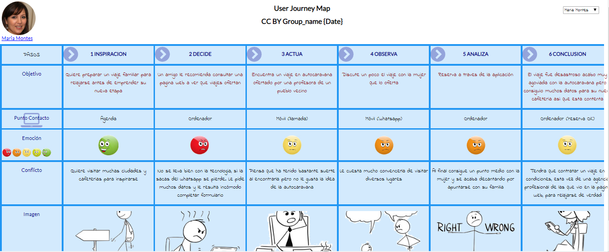
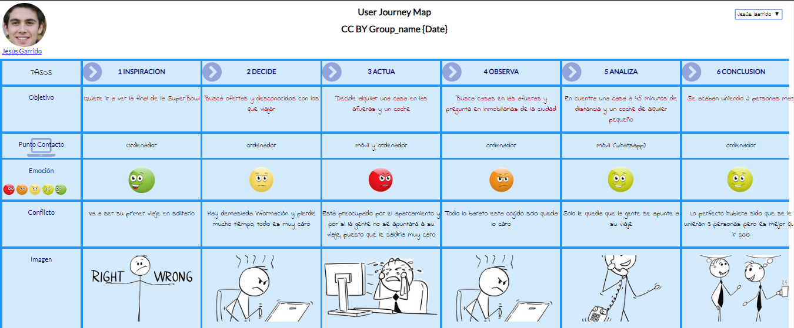
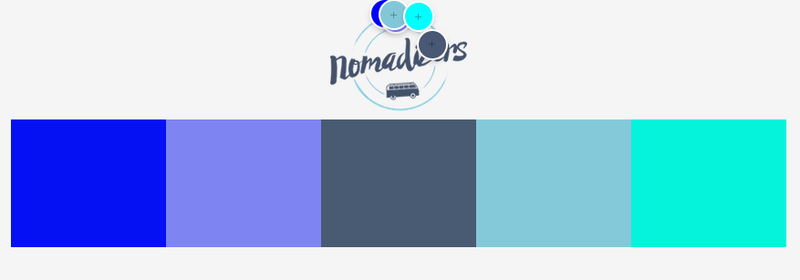
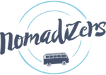

# DIU20
Prácticas Diseño Interfaces de Usuario 2019-20 (Economía Colaborativa) 

Grupo: DIU1_01AABB.  Curso: 2019/20 

Proyecto: Nomadizers

Descripción: No me dejaba ponerlo en la carpeta de la practica 1 por ello lo he tenido que dejar donde esta

Logotipo: 

Miembros
 * :bust_in_silhouette:   AA     :octocat:     
 * :bust_in_silhouette:  BB     :octocat:

----- 

En esta práctica estudiaremos un caso de plataforma de economía colaborativa y realizaremos una propuesta para su diseño Web/movil. Utilizaremos herramientas y entregables descritos en el siguiente CheckList (https://github.com/mgea/UX-DIU-Checklist) 

Qué es economia colaborativa: Martínez-Polo, J. (2019). **El fenómeno del consumo colaborativo: del intercambio de bienes y servicios a la economía de las plataformas**, *Sphera Publica, 1*(19), 24-46. http://sphera.ucam.edu/index.php/sphera-01/article/view/363/14141434

>>> Este documento es el esqueleto del report final de la práctica. Aparte de subir cada entrega a PRADO, se debe actualizar y dar formato de informe final a este documento online. 

# Proceso de Diseño 

## Paso 1. UX Desk Research & Analisis 

 1.a Competitive Analysis
-----

>>>Esta aplicación a simple vista me ha parecido de las mejores en su genero por eso la he elegido. En general este tipo de aplicaciones se basan en una buena primera impresión y despues fallan en aspectos basicos buscando el mejor trabajo invertido y el mayor beneficio posible.

 1.b Persona
-----

>>> He intentado crear personajes lo mas realistas posibles, uno con una experiencia positiva y otro con una negativa.

 1.c User Journey Map
----

>>> Las experiencia no queria que fueran algo normal pero tampoco algo muy rebuscado e imposible asi que hice que uno creara un viaje, como tenia que ser con desconocidos pense que fuera algo poco habitual pero posible (el viaje a la Super Bowl) y otro mas normal pero tampoco mucho(la dueña de la cafeteria que va en caravana por Inglaterra). 

 1.d Usability Review
----
>>>  Revisión de usabilidad: (toma los siguientes documentos de referncia y verifica puntos de verificación de  usabilidad
>>>> SE deben incluir claramente los siguientes elementos
>>> - Enlace al documento:  (sube a github el xls/pdf) 
>>> - Valoración final (numérica): 
>>> - Comentario sobre la valoración:  (60-120 caracteres)

## Paso 2. UX Design  

 2.a Feedback Capture Grid
----

>>> Comenta con un diagrama los aspectos más destacados a modo de conclusion de la práctica anterior,

 Interesante | Críticas     
| ------------- | -------
  Preguntas | Nuevas ideas
  
  
  
>>> ¿Que planteas como "propuesta de valor" para un nuevo diseño de aplicación para economia colaborativa ?
>>> Problema e hipótesis
>>>  Que planteas como "propuesta de valor" para un nuevo diseño de aplicación para economia colaborativa te
>>> (150-200 caracteres)

 2.b Tasks & Sitemap 
-----

>>> Definir "User Map" y "Task Flow" ... 

 2.c Labelling 
----

>>> Identificar términos para diálogo con usuario  

Término | Significado     
| ------------- | -------
  Login¿?  | acceder a plataforma

 2.d Wireframes
-----

>>> Plantear el  diseño del layout para Web/movil (organización y simulación ) 

## Paso 3. Make (Prototyping) 

 3.a Moodboard
-----

>>> Partiendo de la experiencia vista en Nomadizer, con la cual no tengo ningún problema puesto que la veo adecuada para este tipo de paginas, yo usaría una tipografía la cual fuera amigable y un poco mas exótica la cual incite un poco a la aventura (como por ejemplo: https://www.tipografias.org/f-3200-long_cool_grandma.html , pero esta tipografía no se usaría por ejemplo en las conversaciones de chat entre usuarios sino en algunos títulos y apartados donde sus contenidos tendrían una tipografía mas seria para acentuar la fácil compresión por parte del usuario).
 Y para los pocos iconos que usaría en la aplicación usaría unos iconos amigables pero serios al mismo tiempo para infundir tranquilidad y confianza en el usuario. Yo partiría sobre la base que tiene creada Nomadizer pues me parece que en general la pagina cumple con su cometido aunque añadiría los cambios que he comentado en las anteriores practicas como el sistema de búsqueda por palabra clave y algunos cambios en el diseño para evitar la sensación de vacío que genera el actual diseño y una mejor organización de la información, tras aplicar estos cambios yo haría una prueba de usabilidad para ver como diferentes usuarios reaccionan al antes y al después y sobre ello tomaría diversas medidas. Ademas usaria tonalidades que se relacionaran bien con el logotipo de la pagina como las siguientes:

  3.b Landing Page
----

>>> Cuando vi la pagina principal de Nomadizers me gusto bastante lo que estaba viendo pero a medida que iba avanzando me di cuenta de que saturaba al usuario de información.

 3.c Guidelines
----

>>> Empece este proyecto por que me pareció curiosa la idea de que la gente viajara con desconocidos, nunca se me habría ocurrido algo como esto, y a apartir de esto pense como la gente se tomaría esta idea si le gustaría o si no el concepto. A mi personalmente no es algo que me atraiga pero tampoco le digo que no puesto que he realizado un viaje con un grupo de desconocidos pero este estaba organizado por una empresa y la idea de que no halla algún tipo de organización que se responsabilice de si pasara algo no me da confianza. 

>>>Comence por pensar desde mi punto de vista de como debería de ser la aplicación, debería dar una sensación agradable y seria al mismo tiempo para dar confianza en el usuario. Nomadizer conseguía esta sensación a ratos, ver como se centraban tanto en la idea de que te hicieras premiun para conseguir una serie de ventajas que solo beneficiarían a una pequeña parte de los usuarios me chocaba mucho, puesto que yo pensaba que esta pagina mayormente la usarían persona que quisieran hacer un viaje puntual, conocer a gente y ahorrarse una buena cantidad de dinero, puesto que la gente normalmente hace un viaje al año en su época de vacaciones no podrían aprovechar los descuentos del estado de premiun al ser algo que se rentabiliza con mas de un viaje al año y ademas se puede hacer un viaje de mas o menos el mismo presupuesto en una agencia local ayudando así a la economía de la zona.

>>>Tras esto estuve indagando un poco en la pagina y vi que no había una gran cantidad de viajes ofertados en ese momento. Comencé con la idea de buscar un viaje a California una región muy turística de EEUU la cual contiene ciudades muy famosas como San Francisco o Los Angeles, ademas del parque de atracciones de Disneyland, parques naturales y otra gran cantidad de lugares culturales. Pero no encontré nada absolutamente nada lo cual sinceramente no me sorprendía puesto que a mi manera de ver este es un mercado muy pequeño con poco publico, la gran parte de la gente que viaja lo hace a lugares que o ya conoce y no necesita de este tipo de aplicaciones puesto que va con amigos o familiares, o decide contratar una empresa especializada para no tener problemas aunque se tengan que gastar un poco mas de dinero, y también existe entre otros el caso de la gente o grupo que se organiza su propio viaje a lugares que no conoce pero sin invitar a desconocidos. Esto nos deja de margen una gran cantidad de gente joven a la cual le gusta la aventura y quiere conocer gente y vivir nuevas experiencias o gente que se quiere ahorrar dinero.

>>>Ya con estos puntos de partida vi bastante difícil el tema y me parecío un tipo de negocio en el cual yo no me involucraría puesto que no le veo una gran cantidad de beneficio por el capital y el tiempo invertido ademas de que te ves expuesto a diferentes tipos de criticas y de quejas por parte de los usuarios al no existir un mecanismo de control de usuarios y bots de la pagina los cuales puedes ser simplemente estafas las cuales busquen quedarse con tu dinero o peor. Aun así pensé en que podía sacar en claro de este proyecto y como a pesar de sus múltiples fallas a mis ojos podría mejorarlo y sacar mucha información y experiencia de este proyecto. 

>>>Primero examine a conciencia la pagina buscando principalmente fallos y encontré muy pocos para mi sorpresa, el diseño de la misma estaba bastante bien y su manera de repartir la información me pareció muy acertada, aun así encontré un par de fallos que me chocaron mucho como la falta de algo tan básico como un sistema de búsqueda por palabra clave, el usuario debía revisar casi todos los viajes para encontrar algo que se asemejara a lo que buscaba. Ademas de esto no había un sistema de clasificación de tu viaje a la hora de crear uno, pro ejemplo si tu quieres crear un viaje para ver coches de época no hay ninguna manera de clasificar tu viaje como un viaje cultural destinado al mundo del automóvil. También encontré muchos espacios en blanco en en algunos apartados de la pagina lo cual aumentaba mi poca confianza en la pagina, ¿quien se fiaría de una pagina la cual ni sus propios desarrolladores le han invertido el tiempo suficiente ni han investigado lo suficiente para ver sus fallos?.

>>>Tras esto busque de manera muy escueta diferentes formas simples de arreglarla, y tras esto le presente la pagina original a diversas personas para ver lo que opinaban de ella, les pedí que buscaran fallas o falta de contenido que quisieran introducir. De aquí saque ideas como la inclusión de un sistema a modo de tutorial para ver el funcionamiento de la pagina y un uso mas activo de las redes sociales de la misma las cuales estaban prácticamente abandonadas puesto que solo se subía información de ofertas que daban empresas y poco mas, no se centraban en lo importante en ofrecer variedad de contenido al usuario y a atraerlo a la pagina con información sobre destinos turísticos y una posible ruta a realizar ya probada por algún usuario y con comentarios de los mismos.

>>>Tras esto seguí los pasos de la practica aplicando toda la información antes recogida para crear el “Analisis Competitivo”, el análisis de “Usabilidad” y el documento de “Usability-review-template”. Tras esto cree dos personajes ficticios totalmente diferentes intente que fueran lo mas opuestos posible, a uno le emocionaba la idea de viajar con desconocidos y a otro no le hacia nada de gracias pero quería ahorrar dinero, uno quería crear un viaje y otro unirse a uno ya creado. Luego pensé en las posibles vivencias que pudieron sucederles a cada uno para sus experiencias de usuario. Y decidi poner un caso en el cual la experiencia fuera positiva y otro en el que fuera negativa intentando crear casos lo mas cercanos a la realidad posible.

>>>En la siguiente practica realialice una malla de recepcion de información, esto me dio nuevos aspectos que no habia explorado como la posibilidad de que existiera una aplicación movil pero no encontre ninguna y me parecio una idea apropiada ahora que la mayoria de usuarios utilizan mas para navegar por internet un movil antes que un ordenador, así que una aplicación de movil la haria mas accesible a todos los usuarios. También realice una matriz de tareas con los tipos de usuarios que usarian en mayor o menor medida dichas tareas y confirme lo que ya sospechaba, cualquier tipo de usuario ya registrado(creador de actividades o usuario que se apunta a las actividades) puedes usar toda clase de opciones las vaya a usar o no, cosa que tambien viene bien puesto que si un usuario que se apunta a actividades decide un dia crear su propia actividad tiene que tener la posibilidad de hacerlo. Lo siguiente que hice fue el sitemap lo mas simple posible puesto que en la pagina principal hay muchisimos encalces y la gran mayoria son a viejes, agencias de viaje o blogs, cosas que van variando con el tiempo asi que decidi incluir los apartados mas importantes a pesar de existir mas. Y por ultimo cree los bocetos Lo-Fi con las ideas que habia descrito en apartados anteriores, son pocos puesto que en general la pagina me parece que esta bastante bien estructurada en cuanto a diseño.

>>>En cuanto a los patrones los basicos serian:
* Caja de busqueda: para encontrar por palabra clave viajes con diversas actividades, eventos, lugares a visitar...
* Un sistema de navegacion con un sistema nodos y enlaces, siendo especifico seria del tipo "tab navigation".
* Tambien seria necerasio un input, para la entrada masiva de datos a la hora de registrar a un usuario, al crear un evento y en los chats entre usuarios.
* Para mostrar la información de los contenidos de la pagina tales como imagnes y textos descriptivos, como por ejemplo un listinlay para las diferentes actividades ofertadas por los usuarios y un carousel para la publicidad de la pagina asi arreglando problemas de vacio en las paginas.
* Un asistente que avise sobre la proximidad de un evento y sobre diversos viajes que se hayan puesto en oferta los cuales el usuario selecciono.
* Un sistema de rigistro de usuarios con el clasico "sign in".
* Un sistema de paginacion orientada a dispositivos.

  3.d Mockup
----

>>> El actual logotipo de la pagina es a mi modo de ver bastante adecuado puesto que incita a la aventura, para todos los publicos y no es algo muy exagerado.

## Paso 4. UX Check (Usability Testing) 

 4.a A/B Testing
----

>>> Comprobacion de asignaciones para A/B Testing. Asignaciones https://github.com/mgea/DIU19/blob/master/ABtesting.md

>>>> Práctica A: 

 4.b User Testing
----

>>> Usuarios para evaluar prácticas 

| Usuarios | Sexo/Edad     | Ocupación   |  Exp.TIC    | Personalidad | Plataforma | TestA/B
| ------------- | -------- | ----------- | ----------- | -----------  | ---------- | ----
| User1's name  | H / 18   | Estudiante  | Media       | Introvertido | Web.       | A 
| User2's name  | H / 18   | Estudiante  | Media       | Timido       | Web        | A 
| User3's name  | M / 35   | Abogado     | Baja        | Emocional    | móvil      | B 
| User4's name  | H / 18   | Estudiante  | Media       | Racional     | Web        | B 

. 4.c Cuestionario SUS
----

>>> Usaremos el **Cuestionario SUS** para valorar la satisfacción de cada usuario con el diseño (A/B) realizado. Para ello usamos la [hoja de cálculo](https://github.com/mgea/DIU19/blob/master/Cuestionario%20SUS%20DIU.xlsx) para calcular resultados sigiendo las pautas para usar la escala SUS e interpretar los resultados
http://usabilitygeek.com/how-to-use-the-system-usability-scale-sus-to-evaluate-the-usability-of-your-website/)
Para más información, consultar aquí sobre la [metodología SUS](https://cui.unige.ch/isi/icle-wiki/_media/ipm:test-suschapt.pdf)

>>> Adjuntar captura de imagen con los resultados + Valoración personal 

 4.c Usability Report
----

>> Añadir report de usabilidad para práctica B 

## Paso 5. Evaluación de Accesibilidad  

  5.a Accesibility evaluation Report
----

>>> Indica qué pretendes evaluar (de accesibilidad) y qué resultados has obtenido + Valoración personal

>>> Evaluación de la Accesibilidad (con simuladores o verificación de WACG) 

## Conclusión / Valoración de las prácticas

>>> (90-150 caracteres) Opinión del proceso de desarrollo de diseño siguiendo metodología UX y valoración (positiva /negativa) de los resultados obtenidos  

